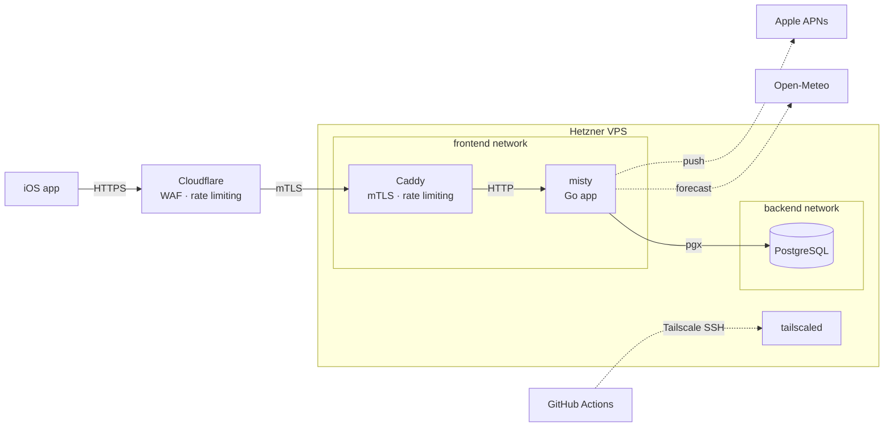

# misty
Backend application for [Misty](https://apps.apple.com/nl/app/misty-fog-forecasts/id6761374118), an iOS app I created mainly for myself. I like to do photography in foggy conditions, but always find out too late. Existing weather apps can give you forecasts, but do not send you push notifications ahead of time. Misty will do exactly that.

## Design

