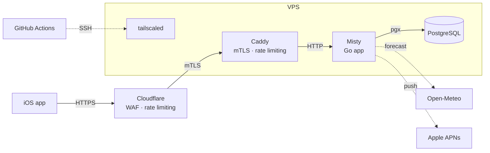
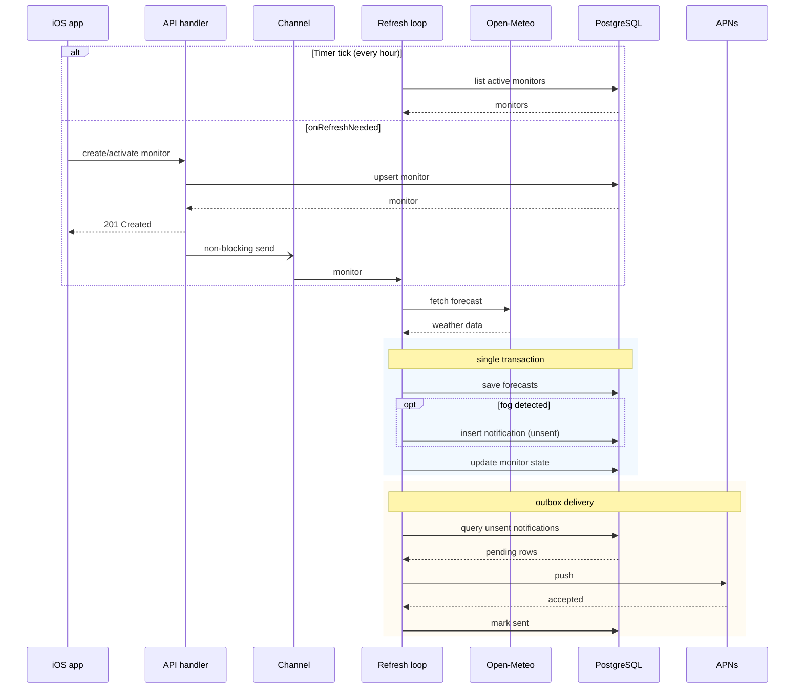

  

# Misty
Backend application for [Misty](https://apps.apple.com/nl/app/misty-fog-forecasts/id6761374118), an iOS app I created mainly for myself. I like to do photography in foggy conditions, but always find out too late. Existing weather apps can give you forecasts, but do not send you push notifications ahead of time. Misty will do exactly that.

## Architecture

## Application

One goroutine serves the API, another refreshes forecasts. The refresh loop `select`s on an hourly ticker and a buffered channel. Creating a monitor pushes it onto that channel so it gets its first forecast right away.

Each refresh writes forecasts, monitor state, and any fog notifications in a single transaction. Notifications use an outbox: delivery runs as a separate step after each pass, pushing unsent rows to APNs and marking them sent.

## Infrastructure and Deployment

The infrastructure is defined in OpenTofu (`infra/`) and is centered around a Hetzner VPS.

The Hetzner firewall only accepts TCP/443 from Cloudflare IP ranges. There is no public SSH port. Cloudflare sits in front with end-to-end TLS, a managed WAF ruleset and rate limiting at 20 requests per 10 seconds per IP.

The firewall blocks non-Cloudflare traffic, but since Cloudflare is a shared platform, another customer could (theoretically) point their DNS at the origin IP and their requests would pass through. Authenticated Origin Pulls prevent that: `infra/aop.tf` generates a CA and client certificate that only my Cloudflare zone presents. Caddy is configured to `require_and_verify` it, refusing any connection without the right cert.

Caddy adds a second rate limiting layer. It also has a path allowlist, so anything not explicitly routed gets a 404 before it reaches the app.

Deployments run over Tailscale SSH from GitHub Actions using auth keys. This makes the github action runner an ephemeral node in my tailnet for the duration of the deployment. The node is tagged, which makes it subject to an ACL that lets it access only the VPS (and not other resources on my tailnet).
